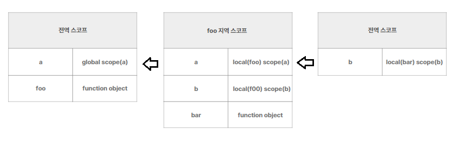
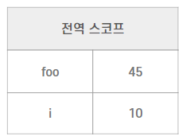
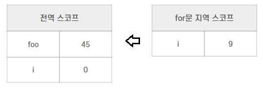

# **스코프**

스코프는 식별자 즉, 변수, 함수, 클래스가 유효한 범위를 의미한다.  
또한, 자바스크립트 엔진이 식별자를 검색할 때 사용하는 규칙으로도 정의할 수 있다.  
내가 이해한 바로 쉽게 풀어쓰자면 **식별자가 유효한 공간**이라고 생각할 수도 있겠다.

**_이 스코프에서 유의할 점은 var과 let,const와의 스코프 범위가 다르게 동작한다는 것이다._**

일단 var과 let,const를 나누지 않고 스코프 자체의 규칙부터 알아보자.

---

### **예제 1)**

```js
var a = "global scope(a)";

function foo() {
  var a = "local(foo) scope(a)";
  var b = "local(foo) scope(b)";

  console.log(a); // 'local scope(foo)'

  function bar() {
    var b = "local(bar) scope(b)";
    console.log(a); // 'local scope(foo)'
    console.log(b); // 'local scope(bar)'
  }

  bar();
}

foo();

console.log(a); // 'global scope(a)'
console.log(b); // 'Uncaught ReferenceError: b is not defined'
```

전역은 코드의 가장 바깥 영역을 의미하고, 지역은 그 함수 몸체 내부를 의미한다.

따라서, 위의 예제에서의 출력값은 다음 주석과 같다. 변수는 자신이 선언된 위치에 의해 스코프가 결정된다.

전역 변수는 어디서든지 참조할 수 있고, 지역 변수는 자신의 지역과 하위 지역에서 유효하다.

위의 예시로 쉽게 말하면,

```
1. 전역 변수는 foo와 bar에서 모두 이용이 가능하다.

2. foo의 지역 변수는 foo 함수 내부와 , foo 내부 함수인 bar 내부에서 이용할 수 있다.

3. bar의 지역 변수는 bar 함수 내부에서 이용이 가능하다.
```

이것을 지칭하는 용어가 바로 **_스코프 체인_** 이다.

---

## **스코프 체인**

---

예제 1) 에서 foo 함수 내에 bar 함수가 존재하는 것처럼,  
함수 내에 또 다른 함수가 존재할 수 있고, 이 것을 **중첩 함수**라고 한다.

이 **중첩 함수**를 필두로 스코프는 계층적인 구조를 갖게되는데, 이 **계층적 구조**를 스코프 체인이라고 할 수 있겠다.

예제 1)을 기반으로 스코프 체인을 만들어 보면 아래와 같이 스코프 체인을 나타낼 수 있다.



이처럼 하나의 계층 구조로 만들어진 스코프 체인을 자바스크립트 엔진이 변수를 검색하는데,

자바스크립트 엔진이 변수를 검색하는 순서는 변수를 참조하는 해당 스코프에서 시작해 점점 상위 스코프 방향 (최상단은 **전역 스코프**) 으로 변수를 검색한다.

예를들어, bar 함수 내부에서 변수 a를 검색하는 과정은 다음과 같다.

```
1. 함수 bar 내부 스코프에서 변수 a를 검색한다.

2. 함수 bar 내부 스코프에는 변수 a가 없기 때문에 상위 스코프로 이동한다.

3. 상위 스코프인 함수 foo 내부 스코프에 존재하는 변수 a를 참조한다.
```

---

## **함수 레벨 스코프**

---

전반적인 스코프의 원리를 알았으니 위에서 말한 var과 let,const를 나눠 보자.

var로 선언된 변수는 함수 레벨 즉, 함수의 코드 블록만을 지역 스코프로 인정한다.

다음 예제를 통해 살펴보자.

### **예제 2)**

```js
var foo = 0;
var i = 0;
for (var i = 0; i < 10; i++) {
  foo += i;
}
console.log(foo, i);
```

위 예제의 출력 값은 45 , 10 으로 출력된다. var로 선언된 변수는 함수가 아닌 for문의 코드 블록은 지역 스코프로 인정하지 않기 때문이다.

위 예제의 스코프 체인을 나타내면 아래 그림과 같을 것이다.



추가적으로 위와 같은 예제의 문제점을 하나 살펴보자면, 함수가 아닌 블록 레벨의 스코프는 지역 스코프로 인정하지 않기 때문에 **전역 변수 i가 중복 선언된 것을 확인할 수 있다.** **_이러한 문제점은 var 키워드 사용의 단점으로 나타난다._**

---

## **블록 레벨 스코프**

---

반대로 let, const로 선언된 변수는 모든 코드 블록을 지역 스코프로 인정한다.

함수 레벨 스코프에서 다뤘던 예제로 블록 레벨 스코프도 다뤄보자.

### **예제 3)**

```js
let foo = 0;
let i = 0;
for (let i = 0; i < 10; i++) {
  foo += i;
}
console.log(foo, i);
```

예제 2)와 달라진 것은 변수를 선언한 키워드가 var에서 let으로 바뀐것 밖에 없다.

하지만 출력결과는 **45 , 10** 이 아닌 **45 , 0** 으로 출력된다.

그 이유는 모든 코드 블록을 지역 스코프로 인정하기 때문인데, 스코프 체인을 그려보면 다음과 같다.



---

따라서, **_어떤 키워드를 사용하느냐에 따라 스코프의 범위가 달라지기 때문에 사용에 유의해야 하고, 되도록이면 변수의 재할당 오류를 피하기 위해 var키워드의 사용을 피하는 것이 좋다는 것을 알아두자._**
