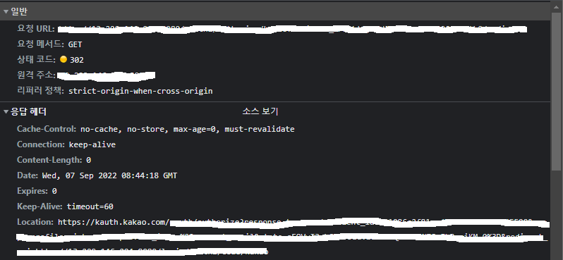
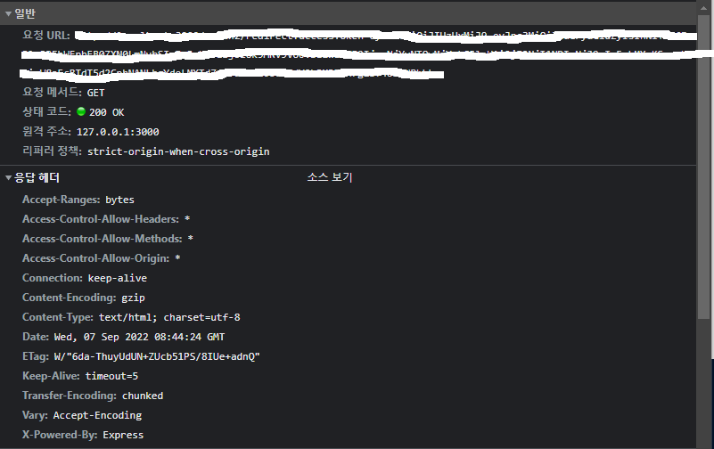

# **Redirect**

Redirect란, 말 그대로 다른 길을 지시하는 것
예를 들어, 브라우저가 특정 URL을 서버로 부터 요청하는 경우 서버가 HTTP 응답 메시지를 통해 브라우저에게 특정 URL이 아닌 다른 URL로 길을 인도하는 것이라고 볼 수 있다.

### **Redirect 과정**

처음 브라우저로 부터 특정 URL 요청을 받은 서버는 HTTP 상태코드로 **300**번대의 상태코드를 나타낸다.  
이 때, 응답 헤더에 포함된 **Location**을 보면 redirect 될 URL을 담고 있는데, 이 redirect URL로 재요청 후 해당 주소로 이동한다.

위의 예시는 OAuth 2.0을 구현하는 과정에서 나타나는 redirect의 예시이다.

다음과 같이 상태코드가 300번대인 것을 확인할 수 있다. 또한, 응답 헤더의 Location을 보면 재요청을 해야하는 주소가 명시되어 있는 것을 볼 수 있는데, 이 때, 클라이언트 단에서 자동으로 Location에 담긴 redirect URL로 요청하여 이동하게 된다.

위의 사진을 보면 클라이언트가 서버에게 새로운 URL로 요청 후 요청에 대한 성공의 응답으로 상태코드 **200**을 응답한다.

이 때 중요한 것은 특정 **URL로 요청 -> 상태코드 300 응답 -> Location 헤더 값으로 재요청 -> 상태코드 200 응답** 이라는 과정이 순식간에 일어난다는 것이다.

### **Redirect 종류**

대표적인 Redirect 의 종류로는 **영구 리다이렉션**과 **일시 리다이렉션**이 있다.

1. 영구 리다이렉션

**영구 리다이렉션**의 경우에는 특정한 리소스의 URI가 영구적으로 이동되었을 때 사용하는 리다이렉션이다. 예를 들어 내가 자주 이용하는 쇼핑사이트를 평소처럼 접속했는데 만약 이 쇼핑사이트의 URI가 바뀌었다고 가정해보자. 이렇게 리소스의 URI가 영구적으로 이동한 경우에는 기본적으로 상태코드 301을 사용한다.

2. 일시 리다이렉션

**일시 리다이렉션**의 경우에는 리소스의 URI가 일시적으로 변경되었을 때 사용하는 리다이렉션이다. 예를들어 PRG(Post-Redirect-Get)이 있는데, POST로 주문 후 웹 브라우저를 새로고침 했을 때, 또 다시 POST로 주문이 들어가는 오류를 막기위해 POST로 주문후 주문 결과를 GET 으로 리다이렉트하여 이후 웹 브라우저를 새로고침해도 중복 주문을 방지하도록 한다. 이 경우에는 기본적으로 상태코드 302를 사용한다.
